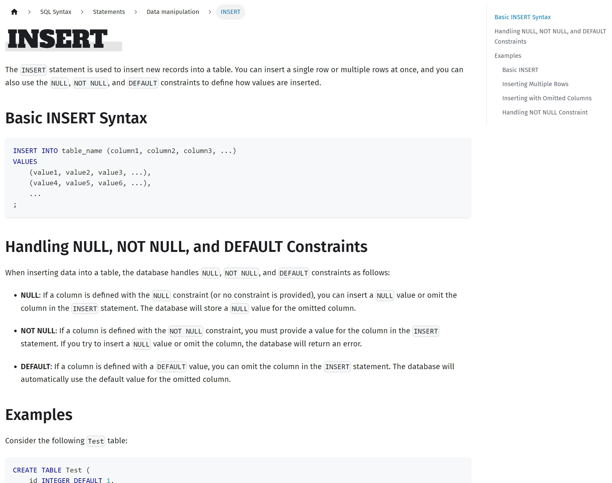
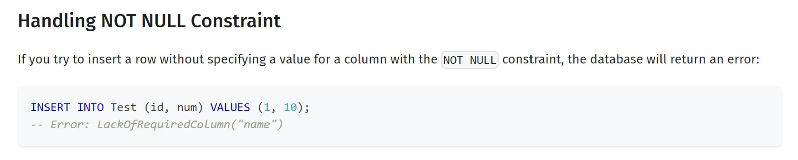

# Test-Driven Documentation - Automating User Manual Creation in GlueSQL

## Introduction: GlueSQL and Test-Driven Documentation
Recently, the GlueSQL project reached a significant milestone with the release of version 0.14. This new version brings a host of fresh features to the table, yet one of the most notable changes is in the realm of documentation. For the first time, we're proud to announce the launch of our official documentation website. Interested readers can explore the full range of user manuals at https://gluesql.org/docs.

Prior to this update, the only way to navigate GlueSQL was by manually inspecting the test code within the test suite. With the recent release, however, a comprehensive user manual has been made public to facilitate a more user-friendly experience. We hope that this new addition will prove beneficial to a broad spectrum of users.

The task of compiling an entire database manual in one go was daunting due to the sheer volume of content required. Surprisingly, this process turned out to be smoother than initially anticipated, largely due to the invaluable aid of ChatGPT, which was instrumental in automating much of the document creation. Specifically, around 80% of the SQL Syntax section was generated using this tool.

This remarkable feat was only possible due to the solid foundation of test codes previously established in GlueSQL. In this article, we'll share how we managed to leverage ChatGPT in such a unique way. Based on our recent experience of crafting documents grounded in testing, we've begun to consider the possibility of entirely automating document creation, save for the initial stages.

Along with sharing our journey so far, we will also reveal our plans for future test-based automation of documentation within GlueSQL.

## Test Codes and Documentation
The GlueSQL project has placed a significant emphasis on writing test codes. This might be a given for a database project; however, the thoroughness of our approach is evident from our line coverage of nearly **99%** for core codes. While we devoted considerable effort to creating these test codes, our primary focus has always been on a different aspect: ensuring that anyone can quickly grasp the content of the tests and easily add new ones.

The intent here is to empower newcomers to GlueSQL to understand the functionality of the software solely by examining integration tests, even in the absence of a user manual.

The integration tests for GlueSQL can be found in the test-suite workspace. For example, here's an excerpt of the test code for the INSERT statement:

```rust
test_case!(insert, async move {
    run!(
        "
CREATE TABLE Test (
    id INTEGER DEFAULT 1,
    num INTEGER NULL,
    name TEXT NOT NULL,
);"
    );

    test! {
        name: "basic insert - single item",
        sql: "INSERT INTO Test (id, num, name) VALUES (1, 2, 'Hi boo');",
        expected: Ok(Payload::Insert(1))
    };


    test! {
        sql: "INSERT INTO Test VALUES(17, 30, 'Sullivan');",
        expected: Ok(Payload::Insert(1))
    };

    test! {
        sql: "INSERT INTO Test (num, name) VALUES (28, 'Wazowski');",
        expected: Ok(Payload::Insert(1))
    };

    test! {
        sql: "SELECT * FROM Test;",
        expected: Ok(select!(
            id  | num | name;
            I64 | I64 | Str;
            1     2     "Hi boo".to_owned();
            3     9     "Kitty!".to_owned();
            2     7     "Monsters".to_owned();
            17    30    "Sullivan".to_owned();
            1     28    "Wazowski".to_owned()
        ))
    };

    // ...
});
```

Despite being written in Rust, these test cases are designed to be comprehensible, even to those unfamiliar with the language. Each test is a complete scenario from start to finish, and the results of each operation are readily observable.

Given that identifying results from SELECT operations in the form of Rust enums and structs can be challenging, we actively utilized macros such as `select!` and `select_with_null!`. We've composed the test cases to demonstrate that the INSERT statement can handle a wide range of cases, including specifying all columns, omitting some, or omitting all.

```rust
test! {
    sql: "INSERT INTO Test (id, num) VALUES (1, 10);",
    expected: Err(InsertError::LackOfRequiredColumn("name".to_owned()).into())
};
```

The tests also include scenarios for expected faulty inputs, indicating the error returns in these situations.

By organizing the tests in this manner, we aim to make it easy for anyone to read and write tests. Our goal was for these tests to serve as "documentation" for GlueSQL contributors. At the time we were writing these tests, we didn't anticipate that they could actually become documentation themselves. But we've come to realize that they have extraordinary potential.

## Leveraging ChatGPT
When we first embarked on writing the User Manual, we were overwhelmed by the sheer volume of content we had to generate. Around the same time, ChatGPT was gaining prominence, and we thought it might be worth trying out, if only to lighten our load slightly.

To our surprise, ChatGPT exceeded our expectations. If the test codes were well written, it was capable of automatically crafting an exceptional document based on them, capturing all essential details.

After several trials and errors, we settled on the following prompt for document generation. While it's still a challenge to use the same prompt for all documentation, we made minor modifications to suit different situations:

```
I'm creating an SQL database documentation website, and I'd like you to help me with one of the pages that introduces the SQL syntax for GlueSQL.

1. Please provide the response content in the "markdown" format, so I can copy and paste it directly. Keep this constraint in mind while writing.  
2. Regardless of the language I use, I need the content written in English.  
3. I will provide some test case code written in the Rust language, which contains SQL examples. Please write the documentation based on these examples, but feel free to change the table names, column names, and data types as needed. Don't include any Rust related content or text in the response. all the response code example should be in plain SQL. 
4. GlueSQL does not have the VARCHAR type. If you want to use that, please use TEXT instead. You don't need to mention this in the response. 
5. Wrap the entire response text using <pre> and </pre> tags so I can copy all the content easily. 

Now, I'd like you to write the following request:  
SQL Statement - "INSERT" 

Here's an example test code you can refer to:

test_case!(insert, async move {
    run!(...
```

Generally, we used the template above, and copied and pasted the test code from our existing test-suite. We leveraged this method to harness our many tests to assist in the creation of the user manual. In the next section, we'll showcase a sample of the documentation generated in this manner. It's quite impressive.

## Success Case: Automated User Manual of GlueSQL
Thanks to ChatGPT, the resulting INSERT document page can be viewed at the following link. It's important to note that we used ChatGPT 4 for this task. Version 3.5 wasn't quite up to the task, and using version 4 was the minimum requirement.

https://gluesql.org/docs/dev/sql-syntax/statements/data-manipulation/insert



The results were quite impressive. ChatGPT neatly categorized the test cases, explained the syntax, outlined constraints, and provided appropriate examples. It didn't stop there; it also skillfully recognized error test cases and incorporated them into the documentation, as shown below.



Isn't it amazing?

## Future Plans: Fully Automating Documentation Generation
While the current documentation is far from perfect and there are many aspects that can be improved, we see great potential in this approach. We believe it's entirely possible to automate the process of writing this kind of document, and writing in general.

In the past, documents like user manuals required a great deal of effort to maintain once they were written. If a document contained real code examples, verifying that the code still worked was often a tedious task. With the ability to automatically generate documentation as we have done here, these issues are no longer problematic.

Previously, you would have to write tests and then also document them separately. If you had to support multiple languages, that would be an additional task. With a tool like ChatGPT, you can automate all of this. All a developer has to do is write the tests. This alone can be sufficient. You can generate documents automatically based on the tests. Eventually, we can even support automatically translating these documents into multiple languages.

The GlueSQL project repository is currently hosted on GitHub and makes good use of various GitHub Actions. We envision a GitHub Action that automatically regenerates a document corresponding to a test when a user modifies the test and raises a Pull Request. Another GitHub Action could automatically translate updated documents into supported languages and create new Pull Requests. The possibilities are truly endless.

Not only will this help with document generation, but it will also provide clear guidelines for writing better test code. If we can automatically generate documents based on written tests, the quality of those documents can serve as an indicator of the quality of the tests themselves. This means that a document automation tool can play the role of a good reviewer for tests. It can greatly reduce the time and effort required for painstakingly reviewing the quality of each test. Developers can also write tests without pressure, evaluate their test code by looking at the generated document, and improve it.

Furthermore, multi-language support becomes a breeze. In my personal experience as a software engineer over the past decade, developing various products such as games, web services, and applications, I often needed to support multiple languages. Each time, there was no definite solution. The optimal approach varied depending on the situation, and there were many things to consider when entrusting translations, such as effectively communicating the context of the target service to the translator. Moreover, regularly updating content and having it retranslated into various languages was a very tedious process. While I tried to automate as much as possible by creating various tools, I was never fully satisfied. I believe ChatGPT can completely solve these issues. If there is a need to provide project-specific context, all you need to do is prepare a prompt in advance. Instead of having to rely on and wait for professional translators, we can now entrust this task to ChatGPT, and we only need a few people to review the translated content.

We are nearing a world where documentation is no longer a burden for developers.

## Conclusion: The Value of Test-Driven Documentation
The use of ChatGPT to generate documentation has proven a significant step forward in the GlueSQL user manual creation process. Through test-driven documentation, we've managed to automate a substantial part of the manual creation process, saving time and effort, and increasing accuracy.

Moreover, this process has unveiled a new potential for documentation: the possibility of fully automating document generation. We've seen that quality tests can become quality documentation with the help of AI, leading to more efficient workflows and possibly better test code as a result.

The journey doesn't stop here. We envision leveraging this capability further to auto-translate our documents into multiple languages, making our product more accessible to a global audience.

As we progress, we hope that our experience can inspire other developers to explore and embrace the benefits of AI-generated, test-driven documentation. It's not just about saving time—it's about improving the way we work, communicate, and share knowledge.
