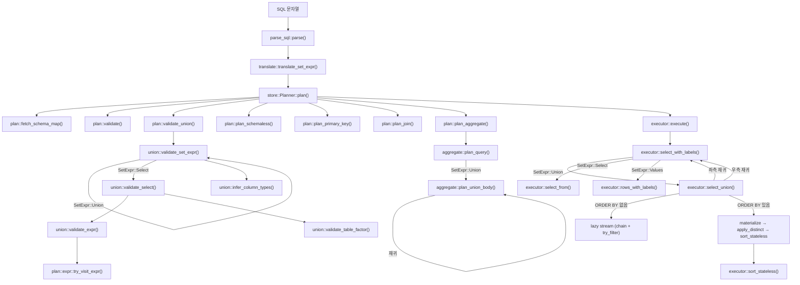

# GlueSQL UNION 구현 분석 문서

> 브랜치: `feat/sql-union` | PR: [#1899](https://github.com/gluesql/gluesql/pull/1899)

---

## 1. 개요

이 브랜치는 GlueSQL에 `SELECT … UNION [ALL] SELECT …` 구문을 추가합니다.  
기존에는 `SetExpr`가 `Select`와 `Values` 두 variant만 가졌으나, 새로운 `Union { left, right, all }` variant가 추가됩니다.

---

## 2. 주요 변경 파일

| 파일 | 역할 |
|------|------|
| `core/src/ast/query.rs` | AST 정의: `SetExpr::Union`, `Projection` enum, `Select.distinct` 추가 |
| `core/src/translate/query.rs` | SQL 파서 출력 → GlueSQL AST 변환 |
| `core/src/plan/union.rs` | Plan 단계 타입 호환성 검증 |
| `core/src/plan/aggregate.rs` | Aggregate 슬롯 플래닝 (Union 분기 처리) |
| `core/src/plan/validate.rs` | 중복 컬럼 참조 검증 (Union 재귀) |
| `core/src/store/planner.rs` | Planner 파이프라인에 `validate_union` 추가 |
| `core/src/executor/select.rs` | 실행: `select_union`, 스트리밍/머티리얼화 분기 |
| `test-suite/src/union.rs` | 통합 테스트 스위트 |

---

## 3. AST 변경사항

### 3.1 SetExpr

```rust
// 변경 전
pub enum SetExpr {
    Select(Box<Select>),
    Values(Values),
}

// 변경 후
pub enum SetExpr {
    Select(Box<Select>),
    Values(Values),
    Union {
        left: Box<SetExpr>,   // 좌측 쿼리
        right: Box<SetExpr>,  // 우측 쿼리
        all: bool,            // true = UNION ALL, false = UNION DISTINCT
    },
}
```

`Union`이 `SetExpr`를 재귀적으로 포함하므로 `A UNION B UNION C`는 `((A UNION B) UNION C)` 좌결합 트리로 표현됩니다.

### 3.2 Projection enum

```rust
pub enum Projection {
    SelectItems(Vec<SelectItem>),  // 기존 명시적 컬럼 목록
    SchemalessMap,                 // 스키마리스 테이블의 * (전체 맵)
}
```

`Select.projection`이 `Vec<SelectItem>` → `Projection`으로 변경됩니다.

### 3.3 Select 구조체

```rust
pub struct Select {
    pub distinct: bool,        // SELECT DISTINCT 지원 추가
    pub projection: Projection,
    pub from: TableWithJoins,
    pub selection: Option<Expr>,
    pub group_by: Vec<Expr>,
    pub having: Option<Expr>,
    // 실행 메타데이터 (Eq/Hash/Serialize 제외)
    #[serde(default, skip)]
    pub aggregate_slots: Option<Vec<super::Aggregate>>,
}
```

`aggregate_slots`는 플래너가 주입하는 실행 메타데이터로, `PartialEq`, `Hash`, `Serialize`에서 제외됩니다.

---

## 4. 함수 콜 그래프



---

## 5. 실제 동작 흐름

### 5.1 Parse / Translate 단계

`core/src/translate/query.rs`의 `translate_set_expr()`가 sqlparser의 `SetOperation { op: Union, set_quantifier, left, right }`를 처리합니다:

```
UNION          → all: false
UNION ALL      → all: true
UNION DISTINCT → all: false
UNION BY NAME  → 오류 (미지원)
```

좌결합으로 파싱되므로 `A UNION B UNION C`는 다음 트리가 됩니다:

```
Union { all: false,
  left: Union { all: false, left: A, right: B },
  right: C
}
```

### 5.2 Plan 단계

`Planner::plan()`은 다음 순서로 실행됩니다:

```
1. fetch_schema_map    — 관련 테이블 스키마 수집
2. validate            — 중복 컬럼 참조 검증 (재귀 Union 처리 포함)
3. validate_union      — Union 타입 호환성 정적 검증
4. plan_schemaless     — 스키마리스 테이블 * 처리
5. plan_primary_key    — PK 플래닝
6. plan_join           — 조인 최적화
7. plan_aggregate      — 집계 함수 슬롯 바인딩 (Union 각 arm별 독립 처리)
```

**`validate_union` 상세**:
- 재귀적으로 Union 트리를 순회
- 각 arm의 컬럼 타입을 **정적으로** 추론 (`infer_column_types`)
- 타입 추론이 가능한 경우에만 비교:
  - `Literal::Number` → INT / FLOAT 판별
  - `Literal::QuotedString` → TEXT
  - 스키마 테이블의 `Identifier` → 스키마에서 타입 조회
  - 복잡한 표현식(함수, 산술 등) → `None` (추론 불가, 검증 스킵)
- 불일치 시 `PlanError::UnionColumnTypeMismatch { index, left, right }` 반환

**`plan_aggregate` 상세**:
- Union 분기는 `plan_union_body()`로 처리
- 각 arm(Select)의 집계 함수 슬롯을 독립적으로 계산
- Union 수준의 ORDER BY는 집계 슬롯 바인딩에서 제외

### 5.3 Execute 단계

`select_with_labels()`가 `SetExpr::Union`을 만나면 `select_union()`을 호출합니다.

**핵심 전략: ORDER BY 유무에 따른 분기**

```
                ┌─────────────────────────┐
                │    select_union()        │
                └────────────┬────────────┘
                             │
              ┌──────────────▼──────────────┐
              │  좌/우 서브쿼리 실행 (재귀)  │
              │  ORDER BY=[], LIMIT/OFFSET  │
              │  제거한 새 Query로 실행     │
              └──────────────┬──────────────┘
                             │
               column count 불일치? → 오류
                             │
              ┌──────────────▼──────────────┐
              │   우측 레이블을 좌측으로    │
              │   통일 (right relabel)      │
              └──────────────┬──────────────┘
                             │
              ┌──────────────▼──────────────┐
              │  outer.order_by.is_empty()? │
              └────┬──────────────────┬─────┘
                   │ YES              │ NO
          ┌────────▼──────┐   ┌───────▼───────────┐
          │  Lazy Stream   │   │  전체 머티리얼화   │
          │                │   │                   │
          │ ALL:           │   │ try_collect 양쪽  │
          │  left.chain(   │   │ DISTINCT:         │
          │  right)        │   │  apply_distinct() │
          │                │   │ sort_stateless()  │
          │ DISTINCT:      │   │ LIMIT/OFFSET 적용 │
          │  try_filter +  │   └───────────────────┘
          │  HashSet       │
          │                │
          │ LIMIT/OFFSET   │
          └────────────────┘
```

**`apply_distinct()` 구현**:
```rust
fn apply_distinct(rows: Vec<Row>) -> Vec<Row> {
    let mut seen = HashSet::new();
    rows.into_iter()
        .filter(|row| seen.insert(row.values.clone()))
        .collect()
}
```
`Value::Null == Value::Null` (PartialEq 구현에서 `true`)이므로 NULL 행도 올바르게 중복 제거됩니다.

**`sort_stateless()` 포지셔널 인덱스 처리**:  
`ORDER BY 1`은 정수 리터럴 `1`이 아니라 첫 번째 출력 컬럼을 가리킵니다.  
`positional_index()` 함수가 이를 감지하여 해당 컬럼 값으로 정렬합니다.

---

## 6. 지원되는 구문

```sql
-- 기본 UNION (중복 제거)
SELECT a FROM T1 UNION SELECT a FROM T2

-- UNION DISTINCT (명시적)
SELECT a FROM T1 UNION DISTINCT SELECT a FROM T2

-- UNION ALL (중복 유지)
SELECT a FROM T1 UNION ALL SELECT a FROM T2

-- 3-way UNION (좌결합)
SELECT a FROM T1 UNION SELECT a FROM T2 UNION SELECT a FROM T3

-- ORDER BY (전체에 적용)
SELECT a FROM T1 UNION SELECT a FROM T2 ORDER BY a

-- LIMIT / OFFSET
SELECT a FROM T1 UNION ALL SELECT a FROM T2 LIMIT 10 OFFSET 5

-- ORDER BY 포지셔널 인덱스
SELECT 3 UNION SELECT 1 ORDER BY 1 ASC

-- 서브쿼리 내 UNION
SELECT * FROM (SELECT a FROM T1 UNION SELECT a FROM T2) AS t

-- IN 서브쿼리 내 UNION
SELECT a FROM T1 WHERE a IN (SELECT a FROM T2 UNION SELECT a FROM T3)

-- VALUES와 UNION
SELECT a FROM T1 UNION VALUES (10), (20)

-- CTAS (CREATE TABLE AS SELECT ... UNION ...)
CREATE TABLE T AS SELECT a FROM T1 UNION SELECT a FROM T2

-- INSERT INTO ... SELECT ... UNION ...
INSERT INTO T SELECT a FROM T1 UNION SELECT a FROM T2
```

---

## 7. 에러 케이스

| 에러 | 타입 | 발생 시점 |
|------|------|-----------|
| 컬럼 수 불일치 | `SelectError::UnionColumnCountMismatch` | Execute |
| 컬럼 타입 불일치 (정적 추론 가능 시) | `PlanError::UnionColumnTypeMismatch` | Plan |
| ORDER BY 포지셔널 인덱스 0 이하 | `SortError::ColumnIndexOutOfRange` | Execute |
| UNION BY NAME | `TranslateError::UnsupportedQuerySetExpr` | Translate |

---

## 8. 외부 DB와의 동작 비교 및 불일치 분석

### 8.1 타입 호환성 처리 [중요 불일치]

| 동작 | GlueSQL | PostgreSQL | MySQL | SQLite |
|------|---------|-----------|-------|--------|
| 타입 불일치 시 | 정적 검증 가능하면 **오류** | **타입 강제 변환** (type coercion) | **묵시적 변환** | 동적 타입 (허용) |
| `SELECT 1 UNION SELECT 1.5` | `PlanError` (INT vs FLOAT) | `numeric` 결과 반환 | float 결과 반환 | 허용 (동적 타입) |
| `SELECT 1 UNION SELECT 'a'` | `PlanError` (INT vs TEXT) | 오류 | TEXT로 묵시적 변환 | 허용 |
| `SELECT NULL UNION SELECT 1` | **허용** (NULL은 타입 추론 불가) | text로 해석 후 1과 불일치 오류 가능 | 허용 | 허용 |

**현재 GlueSQL의 문제점**:
- PostgreSQL은 `SELECT 1 UNION SELECT 1.5`를 `numeric(1.5)`으로 **공통 타입으로 승격**합니다.
- GlueSQL은 이를 `INT vs FLOAT` 불일치로 **거부**합니다.
- **권장 개선**: 타입 코어션 (type coercion) 규칙 추가. 최소한 숫자 타입 간 (INT → FLOAT → Decimal) 묵시적 승격을 허용해야 합니다.

**관련 코드**: `core/src/plan/union.rs` `infer_literal_type()`

---

### 8.2 컬럼 이름 결정 [일치]

| 동작 | GlueSQL | PostgreSQL | MySQL | SQLite |
|------|---------|-----------|-------|--------|
| 결과 컬럼명 | **좌측 SELECT의 이름** 사용 | 좌측 SELECT의 이름 | 좌측 SELECT의 이름 | 좌측 SELECT의 이름 |

GlueSQL은 `labels` (좌측)로 우측 행을 relabel하므로 표준과 일치합니다.

---

### 8.3 NULL 중복 제거 [일치]

| 동작 | GlueSQL | PostgreSQL | MySQL | SQLite |
|------|---------|-----------|-------|--------|
| UNION DISTINCT에서 NULL == NULL | `true` (HashSet 기반) | `true` | `true` | `true` |

GlueSQL의 `Value::PartialEq`는 `(Null, Null) => true`이므로 UNION DISTINCT에서 NULL 행이 올바르게 중복 제거됩니다.  
SQL의 3값 논리에서는 `NULL != NULL`이지만, **집합 연산**에서는 NULL이 동일로 취급됩니다 (SQL 표준 준수).

---

### 8.4 컬럼 수 불일치 감지 시점 [불일치]

| 동작 | GlueSQL | PostgreSQL | MySQL | SQLite |
|------|---------|-----------|-------|--------|
| 컬럼 수 불일치 | **Execute 시점** | Plan/Parse 시점 | Parse 시점 | Parse 시점 |

**현재 GlueSQL의 문제점**:
- `SelectError::UnionColumnCountMismatch`는 실행 시점에만 발생합니다.
- PostgreSQL/MySQL/SQLite는 쿼리 컴파일(파싱) 단계에서 즉시 오류를 냅니다.
- **권장 개선**: `validate_union()`에서 정적으로 컬럼 수를 추론할 수 있는 경우 (SchemalessMap이 아닌 경우) Plan 단계에서 오류를 내도록 개선.

---

### 8.5 INTERSECT / EXCEPT 미지원 [불일치]

| 동작 | GlueSQL | PostgreSQL | MySQL | SQLite |
|------|---------|-----------|-------|--------|
| INTERSECT | **미지원** | 지원 | 미지원 | 지원 |
| EXCEPT | **미지원** | 지원 | 미지원 | 지원 |

GlueSQL의 `translate_set_expr()`는 Union 외 `SetOperation`에 대해 `UnsupportedQuerySetExpr` 오류를 반환합니다.

---

### 8.6 개별 arm의 ORDER BY [일치]

| 동작 | GlueSQL | PostgreSQL | MySQL | SQLite |
|------|---------|-----------|-------|--------|
| `SELECT a FROM T ORDER BY a UNION SELECT b FROM T2` | **파서 수준에서 거부** | 오류 | 오류 | 오류 |

UNION 분기 내의 개별 ORDER BY는 파서가 허용하지 않습니다 (SQL 표준 준수).

---

### 8.7 복잡한 표현식 타입 불일치의 런타임 허용 [잠재적 불일치]

| 동작 | GlueSQL | PostgreSQL |
|------|---------|-----------|
| `SELECT a+1 FROM T1 UNION SELECT b FROM T2` (a=INT, b=TEXT) | Plan 단계에서 **통과** (추론 불가) → 런타임 혼합 타입 가능 | 쿼리 컴파일 시 타입 오류 |

**현재 GlueSQL의 문제점**:
- 복잡한 표현식(함수 호출, 산술식 등)은 Plan 단계에서 타입 추론이 불가능합니다.
- 이 경우 GlueSQL은 검증을 건너뛰고, 실행 시에 서로 다른 타입의 값이 같은 컬럼에 혼재할 수 있습니다.
- PostgreSQL은 이를 컴파일 타임에 에러로 처리합니다.
- **권장 개선**: 스키마 있는 테이블의 표현식에 대해 타입 추론 범위를 점진적으로 확대 (예: `col + 1`은 col 타입에서 추론 가능).

---

### 8.8 타입 코어션 부재로 인한 구체적 시나리오

#### 시나리오 A: 숫자 타입 승격
```sql
-- PostgreSQL: 정상 동작 (INT → numeric 승격)
SELECT 1 UNION SELECT 1.5;
-- 결과: numeric 컬럼에 1, 1.5

-- GlueSQL: 오류
-- PlanError: UNION column type mismatch at column index 0: left returns INT but right returns FLOAT
```

#### 시나리오 B: 스키마 컬럼 간 숫자 승격
```sql
-- T1.age: INT, T2.score: FLOAT
SELECT age FROM T1 UNION SELECT score FROM T2;

-- PostgreSQL: float 결과
-- GlueSQL: PlanError (INT vs FLOAT)
```

#### 시나리오 C: NULL과 타입 있는 값
```sql
-- 표준 SQL / PostgreSQL / SQLite: 허용 (NULL은 any type)
SELECT NULL UNION SELECT 1;

-- GlueSQL: Plan 단계에서 NULL 타입 추론 불가 → 통과 → 실행 성공
-- 실제로 GlueSQL에서는 작동함 (NULL은 infer_literal_type에서 처리되지 않음)
```

---

## 9. 개선 제안 요약

| 우선순위 | 항목 | 설명 |
|---------|------|------|
| **높음** | 숫자 타입 간 암묵적 승격 | INT + FLOAT → FLOAT 허용, INT + DECIMAL → DECIMAL 허용 |
| **높음** | 컬럼 수 불일치 Plan 단계 검출 | `validate_union()`에서 정적 컬럼 수 비교 추가 |
| **중간** | 복잡한 표현식 타입 추론 확장 | `col + 1`, `col * 2` 등 단순 산술의 타입 추론 |
| **낮음** | INTERSECT / EXCEPT 지원 | SetExpr에 Intersect, Except variant 추가 |
| **낮음** | 타입 코어션 런타임 적용 | Plan 시점 추론 불가 시 Execute 시점에 공통 타입으로 cast |

---

## 10. 참고 문헌

- [PostgreSQL: Combining Queries (UNION, INTERSECT, EXCEPT)](https://www.postgresql.org/docs/current/queries-union.html)
- [PostgreSQL: Type Resolution for UNION, CASE](https://www.postgresql.org/docs/current/typeconv-union-case.html)
- [SQLite: Compound SELECT Statements](https://www.sqlite.org/lang_select.html#compound_select_statements)
- [MySQL 8.0: UNION Clause](https://dev.mysql.com/doc/refman/8.0/en/union.html)
